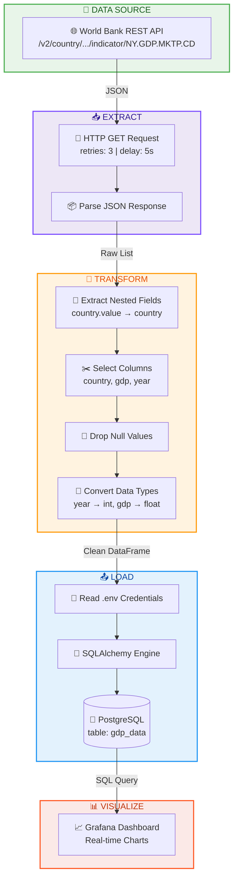

# 🌍 ASEAN GDP Data Pipeline (World Bank API)

[](https://www.python.org)
[](https://www.prefect.io)
[](https://www.postgresql.org)
[](https://podman.io)
[](https://grafana.com)

An end-to-end Data Engineering portfolio project that extracts, transforms, and loads (ETL) Gross Domestic Product (GDP) data of ASEAN countries (1960-2024) using the **World Bank REST API**.

This project demonstrates how to build a modern data pipeline using **Python**, orchestrated with **Prefect**, stored in **PostgreSQL**, and visualized in **Grafana**, all containerized with **Podman** for easy and consistent deployment.

---

## 🏗️ Architecture & Data Flow



| Step | Process | Description |
|:---:|:---|:---|
| 📥 | **Extract** | Fetch raw JSON data from the World Bank API for ASEAN countries (Indonesia, Malaysia, Thailand, Singapore, Vietnam) with automatic retries. |
| 🔄 | **Transform** | Clean and reshape data using Pandas — extract nested values, select columns, drop nulls, and convert data types. |
| 📤 | **Load** | Connect via SQLAlchemy and load the clean DataFrame into a PostgreSQL Data Warehouse. |
| 📊 | **Visualize** | Connect Grafana to PostgreSQL to build interactive, real-time dashboards. |

---

## 🛠️ Tech Stack
- **Data Source**: World Bank REST API
- **Data Processing**: Python, Pandas
- **Orchestration**: Prefect
- **Data Warehouse**: PostgreSQL
- **Visualization**: Grafana
- **Infrastructure**: Podman & Podman Compose

---

## 📂 Repository Structure

```text
.
├── docker-compose.yml   # Container configuration for Postgres & Grafana
├── etl_worldbank.py     # Main ETL pipeline script using Prefect
├── requirements.txt     # Python dependencies
├── .env                 # Database credentials (ignored in git)
└── README.md            # Project documentation
```

## 📈 Dashboard Preview


Link Dashboard: https://snapshots.raintank.io/dashboard/snapshot/zfitkW0t1MeNaRIkAm9S723KP5jZOpi6

---
*Created for portfolio showcase. [Dinar W. Rahman](https://www.linkedin.com/in/dinar-wahyu-rahman)*. 2026
